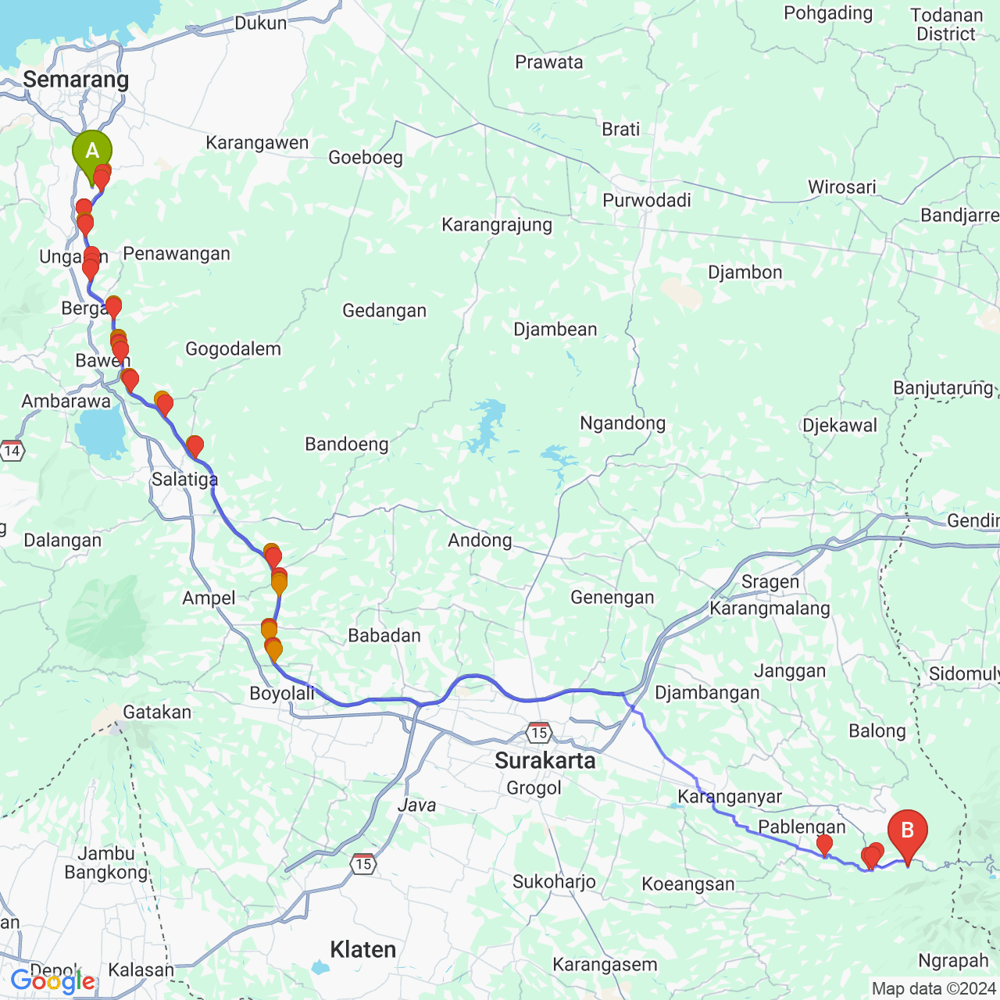

# Route Elevation Analyzer

A Python tool that analyzes and visualizes elevation profiles for routes using Google Maps API. This tool helps you understand the terrain and elevation changes along any specified route.

## Features

- Calculate and visualize elevation profiles for any route
- Compute key statistics including:
  - Total distance
  - Starting and ending elevations
  - Total elevation gain and loss
  - Maximum and minimum grades
  - Identification of steep sections (>15% grade)
- Generate both route map and elevation profile visualizations
- Smooth elevation data to reduce noise
- Detect and handle unrealistic elevation changes

## Sample Output

### Route Map


### Elevation Profile


## How It Works

1. **Route Planning**: Uses Google Maps Directions API to get the route between two points
2. **Data Collection**: 
   - Samples points along the route at specified intervals (default 25m)
   - Retrieves elevation data for each point using Google Maps Elevation API
   
3. **Data Processing**:
   - Calculates distances between consecutive points using geodesic formulas
   - Computes elevation changes and grades
   - Applies Savitzky-Golay filter to smooth elevation data
   - Detects and corrects unrealistic elevation changes (>40% grade)

4. **Analysis**:
   - Calculates cumulative elevation gain/loss
   - Identifies steep sections
   - Generates detailed route statistics

## Installation

1. Clone the repository
2. Install dependencies:
   ```bash
   pip install -r requirements.txt
   ```
3. Copy `.env.example` to `.env` and add your Google Maps API key:
   ```bash
   cp .env.example .env
   ```
4. Edit `.env` and replace `your_api_key_here` with your actual Google Maps API key

## Usage

```python
from simple_route_to_elevation import ImprovedRouteAnalyzer

# Initialize analyzer with your API key
analyzer = ImprovedRouteAnalyzer(api_key)

# Analyze route using coordinates
df = analyzer.analyze_route(
    origin="-7.076283,110.4264041",      # Start point
    destination="-7.6694298,111.1413488", # End point
    base_sampling_interval=25.0           # Sample every 25 meters
)

# Generate visualizations
analyzer.plot_elevation_profile(df)
```

## Requirements

- Python 3.6+
- Google Maps API key with access to:
  - Directions API
  - Elevation API
  - Maps Static API

See `requirements.txt` for full list of Python dependencies.

## License

MIT License
